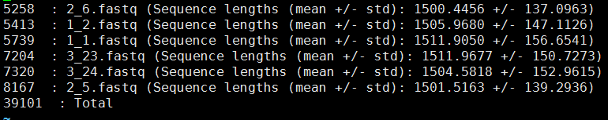
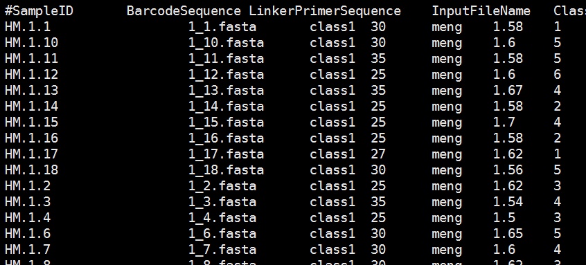

# 16S_analysis_pipline
16S rRNA analysis pipline

Contents
[Data filtering and pre-proccessing](#anchor)

## Data filtering and pre-proccessing
> #### count seqs for each samples (optional)
`count_seqs.py -i "*.fastq" -o seq_counts.txt`

The seq_counts.txt just as below:

> #### Prepare map file and generate combined_seqs.fna
The mapping file format is a Manually edited tab file. You can edit it using excel or other text editor. More about this file's format you can read from this [link](http://qiime.org/documentation/file_formats.html#metadata-mapping-files). My example `mapping_file.txt` just as below:(The  `InputFileName` must be the same as each samples seq file name. )

And notice that the map file for qiime is needed a "#" in the most left item of the header, and the map file for R to plots is not needed.

Then we need to generate a `combined_fasta.fna` for all the samples.

`add_qiime_labels.py -i All_samples_fasta_dir -m mapping_file.txt -c InputFileName -n 1 -o combined_fasta`

Finally, we will get a `combined_fasta/combined_seqs.fna` for the Data filtering.

> #### Data filtering for Full length 16S rRNA from Pacbio sequencing 
(Note: the filter criterion may be different for different data)
We use mothur to filter our data. The command just as below:

`mothur 1-filter/filter.sh > mothur.log`

## OTU analysis (Usearch)
First, get the OTUs seqs and re-map raw data to OTUs.

`nohup 1-otu_analysis/usearch.sh usearch_out_0.97_output 0.97 combined_fasta/combined_seqs.fna &`

Then generate the biom table and tree

`nohup 1-otu_analysis/usearch2.sh usearch_out_0.97_output`

> #### 

> #### 

## Alpha diversity analysis

## Beta diversity analysis

## Comparative analysis

## Predict metagenome with 16S data using Picrust

